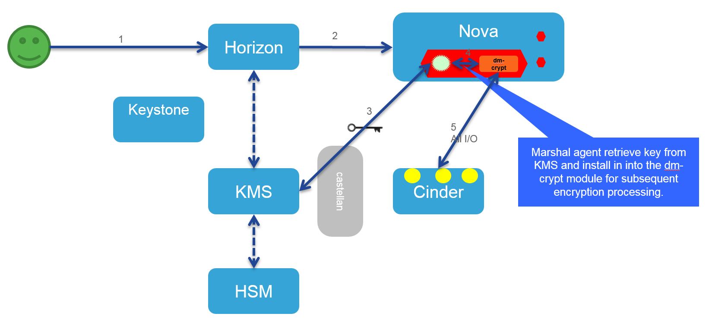

## Marshal
### Overview

* Marshal is an agent service running inside virtual machines, which will be responsible for securely fetching encryption keys from ia KMS like Barbican.
* This agent will be interfacing with the disk encryption subsystem of the underlying operating system to encrypt/decrypt the disk I/O. 
* In the case of Linux-based virtual machines this agent will be interfacing with dm-crypt and for Windows OS it will be interfacing with Bit-locker.
* The agent provides an abstraction service and can be integrated with other encryption subsystem as required.
* When the agent reads a key from the KMS, the key is only stored briefly in a secure temporary file until it can be transferred to the disk encryption subsystem.


**Table of Contents**

- [Overview](#overview)
- [Features](#features)
- [Architecture](#architecture)
- [Getting Started](#getting-started)
- [Software Requirements](#software-requirements)
- [Deployment Procedure](#deployment-procedure)
- [Documentation](#documentation)
- [Roadmap](#roadmap)
- [Core Components and Features](#core-components-and-features)
- [Security](#security)
- [Operations](#operations)
- [Platform Support](#platform-support)
- [Development](#development)
- [License](#license)


### Features

* Disk encryption subsystem abstraction allowing for a consistent interface
* KMS system abstraction allowing for a consistent interface
* Encryption at various levels including full disk encryption, partition encryption including root partition


### Architecture
-----------------------------------------------------------------------------------------------------------------------------




### Getting Started
#### Deployment 
#####For production purposes, Marshal is intended to be deployed as a Debian Package embedded into OpenStack VMs
###### Deploying Using Debian Package
[Building and testing debian package](docs/debian-package-building.md)

##### For test purposes, Marshal can be cloned using normal Git semantics:

#### Clone to local repository:

#####Via SSH: 
```$ git clone git@github.com:openstack/marshal.git ```

#####Via HTTPS: 
```$ git clone https://github.com/openstack/marshal.git ```


### Software Requirements
-----------------------------------------------------------------------------------------------------------------------------

* Python 2.7.8
* Cryptsetup (if Linux OS)

### Deployment Procedure
-----------------------------------------------------------------------------------------------------------------------------

###### Please refer to the [Getting Started Guide](docs/Getting%20Started.md), which covers deployment, configuration, and example usage.

### Documentation

###### All documentation is located [here](docs)


### Roadmap
* KMS for infrastructure tenants 
* Volume encryption (With Marshal)
* Certificate provisioning
* Object Encryption
* High key use tenants and IOT
* KMaaS


### Core Components and Features
-----------------------------------------------------------------------------------------------------------------------------

###### List core components and features here
- [x] Orchestration


### Security
-----------------------------------------------------------------------------------------------------------------------------

###### List the security services it provides
- [x] Encryption


### Operations
-----------------------------------------------------------------------------------------------------------------------------

###### Disk encryption 
###### Automatic key retreival from a KMS 


### Platform Support
-----------------------------------------------------------------------------------------------------------------------------

###### Currently, only the Linux platform is supported using dm_crypt.  Support Windows using bitlocker currently in the planning stages.
###### Currently, only the OpenStack Barbican KMS is supported.  Support for other KMSs is currently in the planning stages.
###### Currently, only cloud-based KMSs are supported.  Support for local KMSs is currently in the planning stages.


### Development
###### Write about the details of how anyone can contribute to the project.


### Getting Support
###### Write about the support details of the project.In case of any issue how anyone can get the support.


### License
###### Write about the license details of the project.
